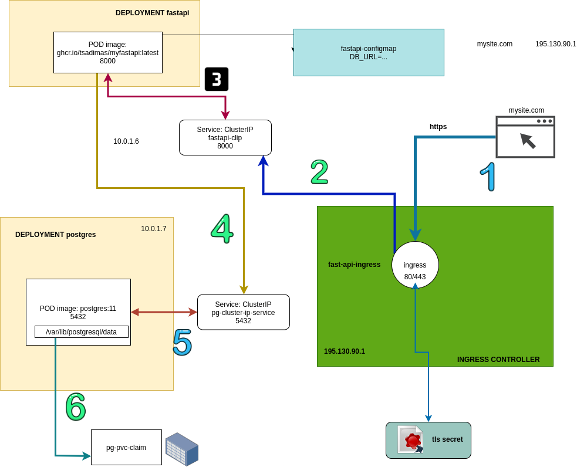

# Run the project locally
```bash
docker-compose up --build
```

# Deploy the project to a kubernetes cluster

* connect to cluster

## persistent volumes
```bash
kubectl apply -f k8s/db/postgres-pvc.yml
```
## configmaps
### create fastapi configmap
```bash
kubectl create configmap fastapi-config --from-env-file=k8s/fastapi/fastapi.env
```

## deployments
```bash
kubectl apply -f k8s/db/postgres-deployment.yml
kubectl apply -f k8s/fastapi/fastapi-deployment.yml
```

## services
```bash
kubectl apply -f k8s/db/postgres-clip.yml
kubectl apply -f k8s/fastapi/fastapi-clip.yml

```
## secrets
* pg secret

```bash
kubectl create secret generic pg-user \
--from-literal=PGUSER=<put user name here> \
--from-literal=PGPASSWORD=<put password here>
```
* tls secret
```bash
cd nginx/certs
kubectl create secret generic tls-secret \ 
 --from-file=tls.crt=server.crt \             
 --from-file=tls.key=server.key\             
 --from-file=ca.crt=ca_bundle.crt
```

## ingress

* allow routing. Get the name of your network interface, e.g. eth0 and run
```bash
sudo ufw allow in on eth0 && sudo ufw allow out on eth0
sudo ufw default allow routed
```

* apply ingress yml file(s)
```bash
kaf k8s/ingress/fastapi-ingress-.yml # for http only
kaf k8s/ingress/fastapi-ingress-ssl.yml # for https
```
# docker registry
## Github Packages
* enable improved container support
* create personal access token
* tag an image
```bash
docker build -t ghcr.io/tsadimas/myfastapi:latest -f fastapi.Dockerfile .
```
* login to docker registry
```bash
cat ~/github-image-repo.txt | docker login ghcr.io -u tsadimas --password-stdin
```
* push image
```bash
docker push ghcr.io/tsadimas/myfastapi:latest
```

## create docker login secret
* create <AUTH> from the command
```bash
echo <USER>:<TOKEN> | base64
```
* create kubernetes secret
```bash
echo '{"auths":{"ghcr.io":{"auth":"<AUTH>"}}}' | kubectl create secret generic dockerconfigjson-github-com --type=kubernetes.io/dockerconfigjson --from-file=.dockerconfigjson=/dev/stdin
```

# Testing
a test.db file is generated inside app directory
```bash
cp .env.example .env
cd app
pytest
```


## Application overview


# Links
* [Control startup and shutdown order in Compose](https://docs.docker.com/compose/startup-order/)

* [Github: create a personla access token for packages](https://docs.github.com/en/github/authenticating-to-github/creating-a-personal-access-token)

* [Configure docker to use with github packages](https://docs.github.com/en/packages/guides/configuring-docker-for-use-with-github-packages)

* [create kubernetes secret to access github packages](https://stackoverflow.com/questions/61912589/how-can-i-use-github-packages-docker-registry-in-kubernetes-dockerconfigjson)

* [kubernetes ingress](https://kubernetes.io/docs/concepts/services-networking/ingress/)

